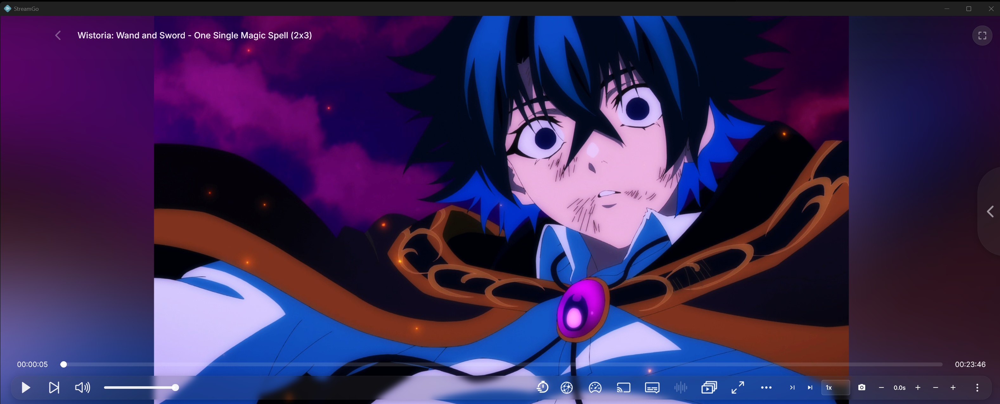

<p align="center">
	<a href="https://stremio.com/">
		
	</a>
	<h1 align="center">StreamGo</h1>
	<h5 align="center">This is a community project and is <b>NOT</b> affiliated with Stremio in any way.</h5>
	<p align="center"><small><b>Note:</b> This repository is intentionally kept out of sync from the latest version by a few iterations to protect the brand. The source files in this repository represent older versions, while the latest releases (EXE files) contain the most up-to-date features and comprehensive updates. The repository files are updated periodically, but the released binaries will always be ahead with the latest improvements.</small></p>
	<p align="center">
		<a href="https://github.com/Bo0ii/StreamGo/releases/latest">
			
		</a>
		<a href="https://github.com/Bo0ii/StreamGo/stargazers">
			
		</a>
		<a href="https://github.com/Bo0ii/StreamGo/releases/latest">
			
		</a>
		<br>
		<a href="https://nodejs.org/">
			
		</a>
		<a href="https://www.typescriptlang.org/">
			
		</a>
		<a href="https://www.electronjs.org/">
			
		</a>
		<a href="https://developer.mozilla.org/en-US/docs/Web/HTML">
			
		</a>
		<a href="https://developer.mozilla.org/en-US/docs/Web/CSS">
			
		</a>
	</p>
</p>

## 🚀 What is StreamGo?

Enhanced Stremio desktop client with **plugins**, **themes**, and **exclusive features**. Runs the Stremio streaming server automatically and loads [web.stremio.com](https://web.stremio.com) in an optimized Electron environment.

---

## ⚡ Exclusive Features

### 🎬 Video Filters & Enhancement
Real-time video processing — sharpness, contrast, saturation, temperature, highlights/shadows, denoise, edge enhance, fake HDR, anti-aliasing. Press `F` to toggle.

### 🎌 Anime4K Upscaling
Real-time WebGL anime upscaling. Lite, Fast, HQ, and an exclusive Bo0ii double-pass mode.

### 🎉 Watch Party
PIN-code rooms with synced play/pause/seek/speed, in-party chat, host transfer.

### 🔍 Stream Filtering
Filter by quality (4K/1080p/…), language, and color range (SDR/HDR/HDR10/Dolby Vision).

### 🎌 Anime Features
AniSkip auto-detects intros/outros with timeline markers. Trending Anime row pulls top airing from MyAnimeList.

### 🎮 Player Enhancements
Screenshot capture, Picture-in-Picture, playback speed (`[` / `]`), subtitle font + delay (`G` / `H`), skip intro (`Shift+Arrow`), position resume.

### 💡 Ambient Light
Dynamic edge glow that samples the frame and bleeds matching color into the window borders.

<p align="center">
	
</p>

### 🎯 Performance & Speed
GPU-accelerated (Metal/D3D11/OpenGL), 144Hz+ smooth scrolling, hardware HEVC/H.265 decode, three BitTorrent streaming profiles.

### 🔧 Core Systems
Auto app updates and auto Stremio Service setup.

### 🎨 Customization
Custom themes and plugins, accent colors, Discord Rich Presence (toggleable).

### 📦 Built-in Plugins
Playback Preview, Card Hover Info (IMDb), Enhanced External Player (VLC/MPC-HC/mpv), Horizontal Navigation, and more.

---

## 📥 Downloads

Get the latest release: **[Download Here](https://github.com/Bo0ii/StreamGo/releases)**

---

## 🔨 Build From Source

```bash
git clone https://github.com/Bo0ii/StreamGo.git
cd StreamGo
npm install
npm run build:win      # Windows
npm run build:linux:x64    # Linux x64
npm run build:linux:arm64  # Linux ARM64
npm run build:mac:x64      # macOS x64
npm run build:mac:arm64    # macOS ARM64
```

---

## 🎨 Themes & Plugins

### Installing Themes
1. Settings → **OPEN THEMES FOLDER**
2. Drop your `.theme.css` file
3. Restart → Apply theme in settings

### Installing Plugins
1. Settings → **OPEN PLUGINS FOLDER**
2. Drop your `.plugin.js` file
3. Restart or <kbd>Ctrl</kbd>+<kbd>R</kbd> → Enable in settings

**Difference:** Addons = catalogs/streams | Plugins = new features

---

## 👨‍💻 Creating Plugins & Themes

### Plugin Template
```js
/**
 * @name YourPluginName
 * @description What it does
 * @updateUrl https://raw.githubusercontent.com/.../your-plugin.plugin.js
 * @version 1.0.0
 * @author YourName
 */
```

### Theme Template
Create a `.theme.css` file with CSS modifications. Use devtools (<kbd>Ctrl</kbd>+<kbd>Shift</kbd>+<kbd>I</kbd>) to find class names.

**Submit to:** [Community Registry](https://github.com/REVENGE977/stremio-enhanced-registry)

---

## ⚠️ Known Issues

- Some streams with embedded subs may not show subtitles (Stremio Web limitation)
- macOS requires bypassing Gatekeeper (app not signed)

---

## 📝 Notice

**This project is NOT affiliated with Stremio.**

Licensed under MIT License.

<p align="center">Developed by <a href="https://github.com/Bo0ii">Bo0ii</a> | Forked from <a href="https://github.com/REVENGE977">REVENGE977</a> | Licensed under MIT</p>
<p align="center">Community Registry by <a href="https://github.com/REVENGE977">REVENGE977</a></p>
